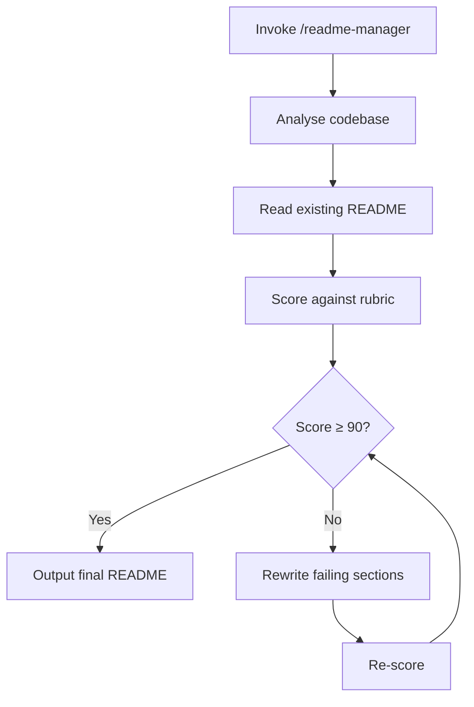

# readme-manager


## Overview

READMEs drift out of date, skip key sections, or bury the information a new user actually needs. This skill analyses a repository's contents against a gold-standard template, scores the existing README across three principles, then iteratively rewrites it until the score reaches 90 or a ceiling is hit. It is for anyone who wants a consistent, high-quality README without doing the audit manually.

## How It Works



## Getting Started

### Prerequisites

- [Claude Code](https://claude.ai/code) — the skill runs inside a Claude Code session

### Installation

The skill is managed via GNU Stow as part of this dotfiles repo. After stowing, it is available automatically in any Claude Code session.

```sh
$ cd ~/dotfiles && stow .
// .claude/skills/readme-manager/ is symlinked into ~/.claude/skills/readme-manager/
```

### Usage

Invoke from any Claude Code chat session while inside the target repository:

```sh
/readme-manager
// Claude analyses the repo, scores the README, and writes an improved version
```

The skill targets the current working directory. Run it from the repo root for best results.

## Structure

```sh
readme-manager/
├── 📄 SKILL.md            # Skill definition: scoring rubric, workflow steps, rules
├── 📄 TEMPLATE-README.md  # Gold-standard README template used as the scoring baseline
└── 📄 README.md           # This file
```

## References

- [GNU Stow](https://www.gnu.org/software/stow/) — used to symlink this skill into `~/.claude/skills/`
- [About READMEs — GitHub Docs](https://docs.github.com/en/repositories/managing-your-repositorys-settings-and-features/customizing-your-repository/about-readmes) — the purpose a README must fulfil, referenced in the scoring rubric
