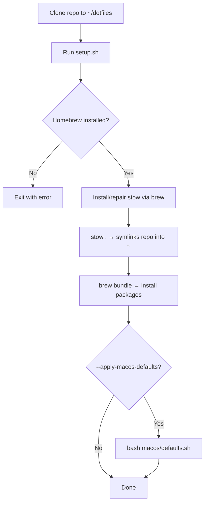

# dotfiles


## Overview

Setting up a fresh machine from scratch is slow and error-prone without a single source of truth for your configuration. This repo centralises shell config, app config, bootstrap scripts, and macOS defaults, all symlinked into `~` via GNU Stow so any change made in the repo is immediately live. It is intended for personal use on any Unix-like machine; macOS-specific defaults are available but optional.

## Getting Started

### Prerequisites

- [Homebrew](https://brew.sh/) — required before running `setup.sh`
- [Git](https://git-scm.com/downloads) — to clone the repo
- macOS — only required if using `--apply-macos-defaults`

### Installation

```sh
$ git clone https://github.com/Harvey-Mackie/dotfiles.git ~/dotfiles
$ cd ~/dotfiles
$ ./setup.sh
// Installs stow, symlinks repo into ~, installs .Brewfile packages
```

To also apply macOS system defaults:

```sh
$ ./setup.sh --apply-macos-defaults
// Applies defaults then exits
```

### Configuration

After bootstrap, copy the token template and add your local secrets:

```sh
$ cp shell/tokens.example.sh shell/tokens.sh
// shell/tokens.sh is gitignored — safe for API keys and local vars
```

Then reload your shell:

```sh
$ source ~/.bashrc   # or source ~/.zshrc
```

### Usage

Add a new dotfile to the repo and re-stow:

```sh
$ stow .
// Symlinks any new files from ~/dotfiles into ~
```

Install or update all packages from the Brewfile:

```sh
$ brew bundle --file ~/dotfiles/.Brewfile
// Installs missing packages, skips already-installed ones
```

## Structure

```sh
dotfiles/
├── 📄 setup.sh              # Bootstrap: stow + brew bundle + optional macOS defaults
├── 📄 .Brewfile             # Source of truth for packages, casks, VS Code extensions
├── 📄 .bash_profile         # Loads .bashrc for login shells
├── 📄 .bashrc               # Bash startup; sources shell/shared.sh
├── 📄 .zshrc                # Zsh startup; sources shell/shared.sh
├── 📄 .tmux.conf            # tmux config; references tmux/ for plugins
├── 📄 .gitconfig            # Global git config
├── 📁 shell/
│   ├── shared.sh            # Shared aliases, navigation shortcuts, sources scripts/
│   └── tokens.example.sh   # Template for local secrets (copy to tokens.sh)
├── 📁 scripts/              # Interactive shell functions; auto-sourced via shared.sh
├── 📁 .config/              # App and CLI config (alacritty, nvim, git, gh, starship…)
├── 📁 .ssh/                 # SSH host aliases (includes homelab)
├── 📁 macos/                # macOS defaults scripts
├── 📁 init/                 # Bootstraps notes and code repos into ~/Documents
└── 📁 tmux/                 # Vendored tmux plugins
```

## How It Works



## References

- [GNU Stow](https://www.gnu.org/software/stow/) — symlink management used to link this repo into `~`
- [Homebrew](https://brew.sh/) — package manager; `.Brewfile` is the package manifest
- [Using the SSH Config File](https://linuxize.com/post/using-the-ssh-config-file/) — SSH config patterns and options
